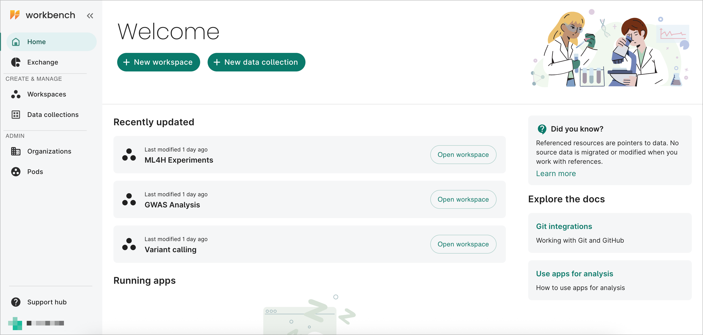
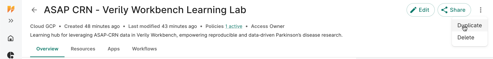
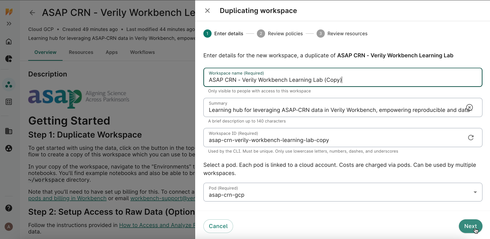

# Getting Started with Verily Workbench

This guide walks you through the essentials of accessing and using **Verily Workbench** with **ASAP‑CRN data**. Follow the steps below to log in, set up your workspace, review resources, launch apps, and connect a GitHub repository.

---

## 1. Access and Log In

1. Navigate to the [Verily Workbench login page](https://workbench.verily.com).  
2. Sign in using your institutional or approved credentials associated with ASAP CRN access.  
3. Once logged in, you will land on the **Workbench dashboard**, which lists your available pods and workspaces.

!!! warning "Pod required"
    You must belong to at least one **billing pod** in order to perform operations that incur costs, such as creating workspaces or running cloud apps. If you are unsure whether you have pod membership, contact your project administrator or Verily support before proceeding.

---

## 2. Workspaces

Workspaces in **[Verily Workbench](https://workbench.verily.com)** are collaborative environments where you can manage data, launch apps, and run notebooks. Each workspace serves as a container for your analyses, storing your data, compute environment, and version-controlled code together for easy collaboration and reproducibility.

---

### Access the Learning Lab Workspace

The **ASAP CRN - Verily Workbench Learning Lab workspace** was created in conjunction with this [GitHub repository](https://github.com/ASAP-CRN/verily-workbench-learning-lab). It provides a pre-configured environment that mirrors the tutorials, scripts, and case studies included in this Learning Lab.

**Open the workspace:**  
[🔗 ASAP CRN – Verily Workbench Learning Lab ](https://workbench.verily.com/workspaces/asap-crn-verily-workbench-learning-lab)

!!! note
    The shared workspace is **view-only**.  
    To run notebooks or make edits, you’ll need to **duplicate** it into your own project area.
---

### Duplicating a Workspace

Duplicating the Learning Lab workspace creates your own editable copy while preserving the original as a reference. This is required for all users so you can freely explore, test, and save work without affecting the shared environment.

1. Open the **[ASAP CRN Learning Lab workspace](https://workbench.verily.com/workspaces/asap-crn-verily-workbench-learning-lab)**.  
2. Click the **Workspace menu (⋮)** in the upper-right corner.  
     
3. Select **Duplicate**.  
4. Enter a clear name for your copy (for example, `My-Learning-Lab-Sandbox`).  
5. Complete the duplication dialog screens.  
   
6. Click **Duplicate** on the final screen. It should take less than a minute for the system to duplicate the workspace and all associated resources. Your duplicated workspace will appear under the **Workspaces** tab in the left navigation panel.

!!! tip
    Your duplicated workspace is fully independent.  
    You can install packages, upload small test datasets, or modify notebooks without affecting the shared Learning Lab version.
