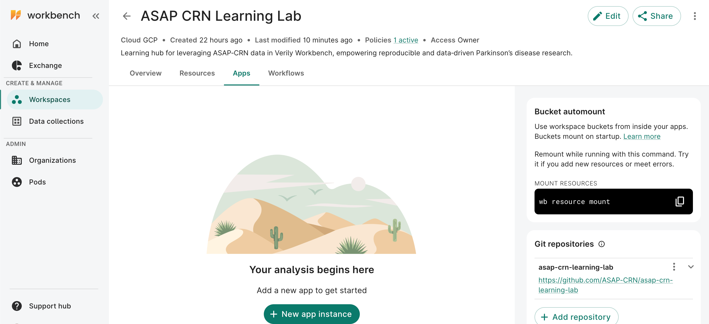

# Getting Started with Verily Workbench

This guide walks you through the essentials of accessing and preparing your workspace **Verily Workbench**. Follow the steps below to gain access, set up your workspace, review resources, launch apps, and connect a GitHub repository.

---

## 1. Access

1. Navigate to the [Verily Workbench login page](https://workbench.verily.com).  
2. Sign in using your institutional or approved credentials associated with ASAP CRN access.  
3. Once logged in, you will land on the **Workbench dashboard**, which lists your available pods and workspaces.

!!! warning "Pod required"
    You must belong to at least one **billing pod** in order to perform operations that incur costs, such as creating workspaces or running cloud apps. If you are unsure whether you have pod membership, contact your project administrator or Verily support before proceeding.

---

## 2. Workspaces

Workspaces in **[Verily Workbench](https://workbench.verily.com)** are collaborative environments where you can manage data, launch apps, and run notebooks. Each workspace serves as a container for your analyses, storing your data, compute environment, and version-controlled code together for easy collaboration and reproducibility.

---

### Access the Learning Lab Workspace

The **ASAP CRN Learning Lab workspace** was created in conjunction with the [ASAP CRN Learning Lab GitHub repository](https://github.com/ASAP-CRN/asap-crn-learning-lab). It provides a pre-configured environment that mirrors the tutorials, scripts, and case studies included in this Learning Lab.

**Open the workspace:**  
[🔗 ASAP CRN Learning Lab ](https://workbench.verily.com/workspaces/asap-crn-learning-lab)

!!! note
    The shared workspace is **view-only**. To run notebooks or make edits, you’ll need to **duplicate** it into your own project area.
---

### Duplicating a Workspace

Duplicating the Learning Lab workspace creates your own editable copy while preserving the original as a reference. This is required for all users so you can freely explore, test, and save work without affecting the shared environment.

1. Open the **[ASAP CRN Learning Lab workspace](https://workbench.verily.com/workspaces/asap-crn-learning-lab)**.  
2. Click the **Workspace menu (⋮)** in the upper-right corner.  

     { width="90%" align="center" .shadow}

3. Select **Duplicate**.  
4. Enter a clear name for your copy (for example, `My-Learning-Lab-Sandbox`).  
5. Complete the duplication dialog screens.  

    { width="90%" align="center" .shadow}

6. Click **Duplicate** on the final screen. It should take less than a minute for the system to duplicate the workspace and all associated resources. Your duplicated workspace will appear under the **Workspaces** tab in the left navigation panel.

!!! tip
    Your duplicated workspace is fully independent. You can install packages, upload small test datasets, or modify notebooks without affecting the shared Learning Lab version.

## 3. Resources
The **Resources** tab in Verily Workbench lets you view, organize, and access data and documentation linked to your workspace. Each resource represents a connected Google Cloud Storage (GCS) bucket, dataset, or documentation file that you can browse and use in analyses.

{ width="90%" align="center" .shadow}

---

### Exploring and Navigating Resources

1. From the top navigation bar, click **Resources**.  
2. Click **Browse** to open the folder tree and explore available datasets, curated tables, and metadata files.  
3. Select any file to open its **details panel**, where you can view size, modification date, and storage location.

Common folders in this workspace include:

- **Data** – core datasets and metadata tables  
- **Multi Cohort Curated Data** – harmonized multi-cohort collections  
- **Cohort Analysis** – processed cohort-level outputs  
- **Team Curated Data** – data contributed by collaborating teams  
- **ws_files** – your personal workspace storage  

---

### Previewing and Downloading Files

Once you locate a file of interest, you can quickly view or download it without leaving the **Resources** tab.

1. In the **details panel**, choose one of the following actions:
   - **Preview** – opens a quick viewer for text, CSV, or JSON files.  
   - **Download** – click the **⋮ (three dots)** menu next to the file name and select **Download** to save it locally.  

!!! tip 
    To open the file in **Google Cloud Platform (GCP)**, click **Open in GCP** in the upper-right corner above the details panel. This opens the linked Google Cloud Storage bucket in a new browser tab, where you can view the full directory and metadata.

## 5. GitHub Repositories

Your duplicated **ASAP-CRN Learning Lab workspace** should already have the **Learning Lab GitHub repository** connected. This ensures that all tutorial notebooks and example files are automatically available when you launch an App.

!!! note
    GitHub repositories in Verily Workbench are **automatically cloned to your apps** to help you manage source code and stay synced with the latest materials.

---

### Connecting a Repo

If the **ASAP-CRN Learning Lab** repository is not already linked to your workspace (or if you’d like to add another repository), you can connect it manually:

1. Open your workspace and navigate to the **Apps** tab.  
2. Click **+ Add Repository**.  
3. In the **Name** field, enter `asap-crn-learning-lab`.  
4. In the **Repository URL** field, the repo URL:  
   [https://github.com/ASAP-CRN/asap-crn-learning-lab](https://github.com/ASAP-CRN/asap-crn-learning-lab)  
5. Click **Add Repository** to confirm and connect.

Once connected, the repository will be **automatically cloned to your app environments**, allowing you to access tutorial notebooks and scripts directly from within JupyterLab or RStudio.

## 6. Apps

Apps are cloud-based environments in Verily Workbench that let you run code, explore data, and manage analysis workflows. Each workspace can host multiple apps such as **JupyterLab**, **RStudio**, or **Visual Studio Code**, which are connected to your data and GitHub repositories.

---

### Launching an App

1. Open your duplicated **ASAP-CRN Learning Lab** workspace.  
2. In the top navigation bar, click the **Apps** tab.  
3. Select **+ New app instance**.  
   { width="90%" align="center" }
4. In the setup dialog:
    - **Name:** Choose a clear name (e.g.,  `learning-lab-python` or    `learning-lab-rstudio`).  
    - **App type:** Select your preferred environment:
        - **JupyterLab** – recommended for Python-based analysis and tutorials. Can support Rstudio. 
        - **RStudio** – for R and statistical workflows.    
    - **Machine type:** Choose a standard configuration (e.g., *n1-standard-4*).  
5. Click **Create App** to launch.  
   The app will initialize in a few minutes and appear under the **Apps** tab once ready.

---

### Opening and Using Your App

Once your app is running:

- Click your app name to launch the environment.  
- In JupyterLab, navigate to `/repos/asap-crn-learning-lab/tutorials/` to open the Learning Lab notebooks.  
- Access workspace-mounted data from the `~/workspace/` directory, which mirrors the contents of the **Resources** tab.  
---

### Managing Your App
You can pause or delete apps from the **Apps** tab to manage costs or clean up environments. 

- **Stop App** - suspends compute billing while keeping data intact. 
- **Delete App** - permanently removes the app and any unsaved local changes.

!!! warning "Billing Reminder"
    Always stop your app when you’re finished working to avoid unnecessary compute costs.

For additional details, refer to the  
📘 [Verily Workbench Quickstart Guide – Create an App](https://support.workbench.verily.com/docs/getting_started/workspace_quickstart/#5-create-an-app)